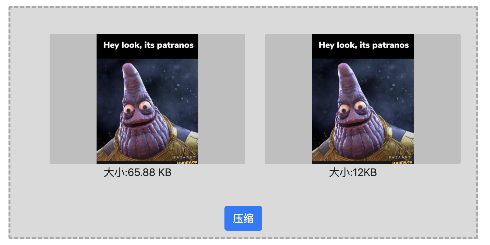

# Image Compressor

# Arch
- Go
- Mux
- Vue

# Sample

# API

### /compress

> request

- method: POST
- content-type: `application/json`
- params:
    - `file_name`:`string`
    - `content`:`string`:base64(image)

> response
- content-type: `application/json`
- params:
    - code
    - message
    - data
        - original
        - compressed
        - level
        - size
        - type

